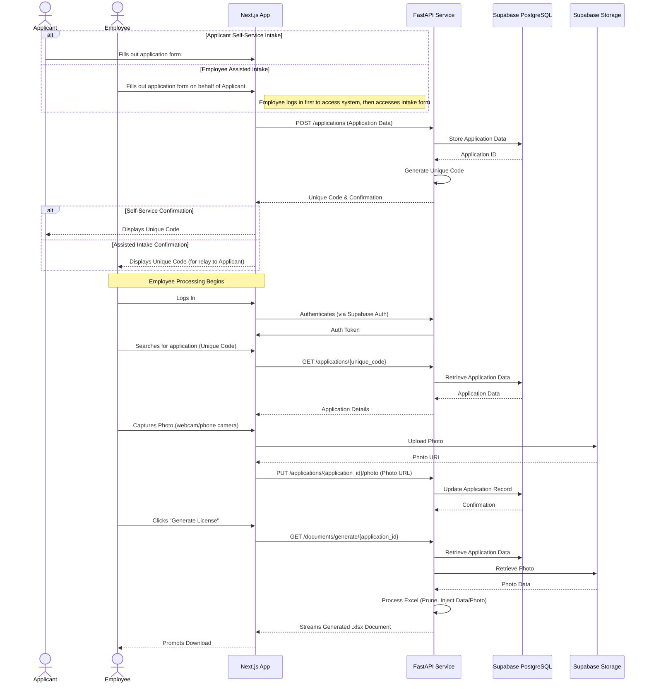
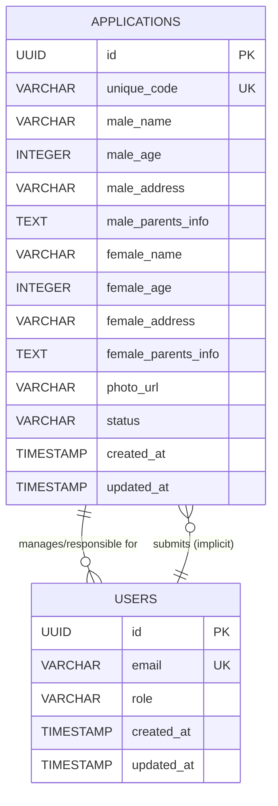

# **PHASE 4 — System Modeling (UML)**

## 4.1 Context Model

### System Context Diagram (Conceptual Description)

```mermaid
c4Context
    title System Context for Marriage License System
    Person(applicant, "Applicant", "Submits marriage license applications")
    Person(employee, "LCR Employee", "Processes applications, captures photos, generates documents")
    Person(admin, "LCR Admin", "Manages employees, views system logs")

    System(marriage_license_system, "Marriage License System", "Automates marriage license application intake and document generation")

    System_Ext(supabase, "Supabase", "Provides Database, Authentication, and Storage Infrastructure")

    Rel(applicant, marriage_license_system, "Submits Application Data (Self-Service)")
    Rel(employee, marriage_license_system, "Submits Application Data (Assisted)")
    Rel(marriage_license_system, applicant, "Provides Unique Code")

    Rel(employee, marriage_license_system, "Login with Credentials, Search by Unique Code, Capture Photo, Request Document Generation")
    Rel(marriage_license_system, employee, "Provides Application Details, Generated Excel Document")

    Rel(admin, marriage_license_system, "Login with Credentials, Manage Employees, Request System Logs")
    Rel(marriage_license_system, admin, "Provides Employee Status, System Logs")

    Rel(marriage_license_system, supabase, "Uses for Data Storage, Authentication, Image Storage", "SQL/Auth/Object Storage")
```

The Marriage License System is at the center, interacting with several external entities:

*   **Applicant:** An external user who initiates the process by submitting application data, either directly (self-service) or through an LCR employee.
*   **LCR Employee:** An internal user who can assist applicants with submitting data, processes applications, captures photos, and generates documents.
*   **LCR Admin:** An internal user responsible for managing employees and viewing system logs.
*   **Supabase:** An external Backend-as-a-Service providing database, authentication, and storage capabilities.

**Data Flows:**
*   **Applicant to System:** Application data (Name, Age, Address, Parents' Info) - via self-service.
*   **LCR Employee to System:** Application data (Name, Age, Address, Parents' Info) - via assisted intake, Login Credentials, Unique Code (for search), Photo (captured), Document Generation Request.
*   **System to Applicant:** Unique 6-Character Code.
*   **System to LCR Employee:** Application Details, Generated Excel Document.
*   **LCR Admin to System:** Login Credentials, Employee Management Commands (add/delete employee), Log Retrieval Request.
*   **System to LCR Admin:** Employee Status, System Logs.
*   **System to/from Supabase:** Data Storage/Retrieval (applications, users, roles), Authentication Requests/Responses, Photo Storage/Retrieval.

## 4.2 Interaction Model

### Sequence Diagram: Applicant Submission & Employee Processing (Conceptual Description)



**Actors:** Applicant (via Browser), Employee, Frontend (Next.js Application), Backend (FastAPI Service), Database (Supabase PostgreSQL), Storage (Supabase Storage).

**Steps (for both self-service and employee-assisted intake):**

1.  **Applicant/Employee Action:** An Applicant fills out the online application form within the **Frontend** (self-service), OR an LCR Employee (already logged in) fills it out on behalf of the applicant (employee-assisted).
2.  **Frontend to Backend:** The **Frontend** sends a `POST /applications` request containing applicant data to the **Backend**.
3.  **Backend Processing:** The **Backend** receives the request, validates the application data (e.g., age checks), and stores it in the **Database**.
4.  **Backend Generates Code:** The **Backend** generates a unique 6-character code for the application.
5.  **Backend to Frontend:** The **Backend** sends a response to the **Frontend** containing the unique code and a success confirmation.
6.  **Frontend Displays Code:** The **Frontend** displays the unique code to the Applicant (if self-service) or to the Employee (who then relays it to the Applicant).
7.  **Employee Action:** An LCR Employee logs into the internal dashboard via the **Frontend**.
8.  **Frontend to Backend:** The **Frontend** sends authentication credentials to the **Backend** (which interfaces with Supabase Auth).
9.  **Backend Authenticates:** The **Backend** authenticates the Employee via **Supabase Auth** and returns an authentication token to the **Frontend**.
10. **Employee Action:** The Employee searches for an application using its unique code in the **Frontend**.
11. **Frontend to Backend:** The **Frontend** sends a `GET /applications/{unique_code}` request to the **Backend**.
12. **Backend to Database:** The **Backend** retrieves the application data from the **Database**.
13. **Backend to Frontend:** The **Backend** returns the application details to the **Frontend**.
14. **Employee Action:** The Employee initiates photo capture using the **Frontend**'s interface (webcam/phone camera).
15. **Frontend to Storage:** The **Frontend** uploads the captured photo directly to **Supabase Storage**.
16. **Frontend to Backend:** The **Frontend** sends a `PUT /applications/{application_id}/photo` request to the **Backend** with the photo's URL.
17. **Backend to Database:** The **Backend** updates the application record in the **Database** with the photo URL.
18. **Employee Action:** The Employee clicks the "Generate License" button in the **Frontend**.
19. **Frontend to Backend:** The **Frontend** sends a `GET /documents/generate/{application_id}` request to the **Backend**.
20. **Backend to Database/Storage:** The **Backend** retrieves necessary application data from the **Database** and the applicant's photo from **Storage**.
21. **Backend Document Generation:** The **Backend** processes the Excel template (`openpyxl`), applies age/address-based sheet pruning, injects data, and embeds the photo.
22. **Backend to Frontend:** The **Backend** streams the generated `.xlsx` document back to the **Frontend**.
23. **Frontend to Employee:** The **Frontend** prompts the Employee to download the generated document.

## 4.3 Structural Model

### Class Diagram / ER Diagram (Conceptual Description)



**Entities:**

*   **`Application`**:
    *   Represents a single marriage license application.
    *   Attributes: `id`, `unique_code`, `male_name`, `male_age`, `male_address`, `male_parents_info`, `female_name`, `female_age`, `female_address`, `female_parents_info`, `photo_url`, `status`, `created_at`, `updated_at`.

*   **`User`**:
    *   Represents a system user (Employee or Admin).
    *   Attributes (Supabase Auth managed): `id`, `email`, `role` (`admin`, `employee`).

**Relationships:**

*   **`Application` <----1--N----> `User` (Employee/Admin Role):** An application is managed/processed by one or more employees/admins over its lifecycle. An employee/admin can process multiple applications.
*   **`Application` <----1--1----> `User` (Applicant Role - Implicit):** Conceptually, each application is submitted by one set of applicants.
*   **`Application` <----1--1----> `Photo` (Stored in Supabase Storage):** Each application is associated with one photo, referenced by `photo_url`.

## 4.4 Behavioral Model

### State Machine Diagram for `Application` (Conceptual Description)

**Entity:** `Application`

**States:**

*   **`Pending`:** The initial state. An application has been submitted by the applicant and is awaiting review and processing by an LCR employee.
    *   **Entry Action:** Store application data in database, generate and display unique code.

*   **`Processing`:** An LCR employee has retrieved the application and is actively working on it, which might include capturing photos, verifying data, etc.
    *   **Entry Action:** Employee views application details, photo capture initiated.

*   **`Generated`:** The marriage license document has been successfully generated and is available for download.
    *   **Entry Action:** Excel document created, saved (temporarily, or streamed), and provided to the employee.

*   **`Rejected`:** The application cannot proceed due to invalid data (e.g., applicant below 18) or other reasons.
    *   **Entry Action:** Mark application as rejected, provide reason for rejection.

**Transitions:**

*   **`Submit`:** From (Initial) to `Pending`.
    *   **Event:** Applicant successfully submits the application form.

*   **`Retrieve & Start Processing`:** From `Pending` to `Processing`.
    *   **Event:** LCR Employee retrieves the application using its unique code.

*   **`Generate Document`:** From `Processing` to `Generated`.
    *   **Event:** LCR Employee successfully triggers the document generation process.

*   **`Reject (Age/Invalid Data)`:** From `Pending` or `Processing` to `Rejected`.
    *   **Event:** System or employee detects an issue (e.g., applicant age < 18) that invalidates the application.

*   **`Complete Processing (Alternative)`:** From `Processing` to `Generated`.
    *   **Event:** All processing steps (including photo capture and validation) are complete, and document generation is ready or initiated.

```mermaid
stateDiagram-v2
    [*] --> Pending
    Pending --> Processing: Retrieve & Start Processing
    Processing --> Generated: Generate Document
    Pending --> Rejected: Reject (Age/Invalid Data)
    Processing --> Rejected: Reject (Invalid Data)
    Generated --> [*] # End state or archival